# SQL Notebook

1. Download your favorite database managemenent extension to view what's going on in your database👇🏻

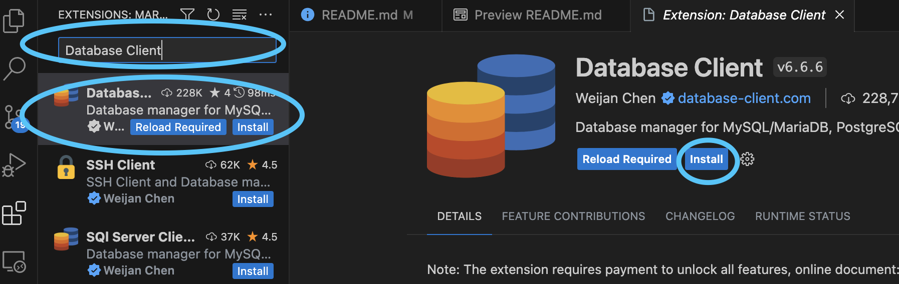

2. Click on the downloaded extension and create a connection 👇🏻

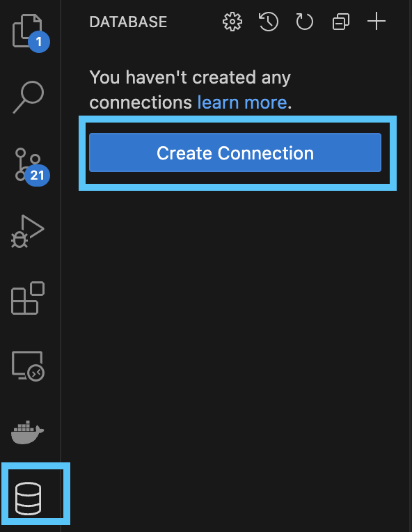

3. Enter your credentials to connect to your database 👇🏻

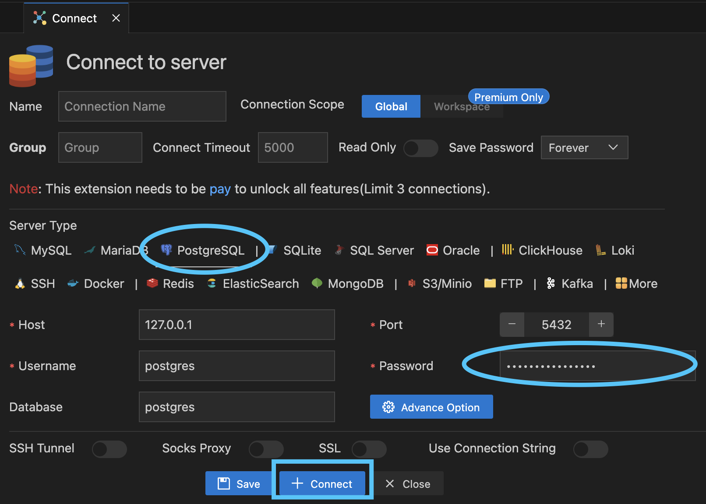

4. Voila! you can view your database 👇🏻

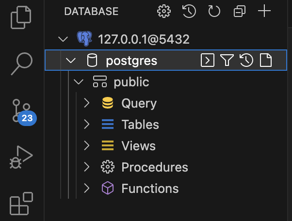

5. Download SQL Notebook 👇🏻

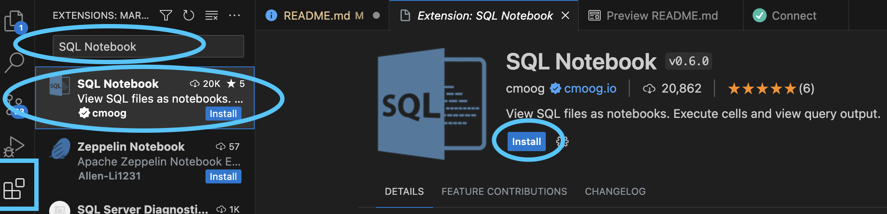

6. Enter your connection credentials 👇🏻

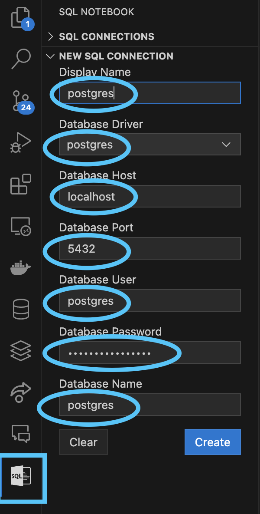

7. Click on SQL CONNECTIONS tab 👇🏻

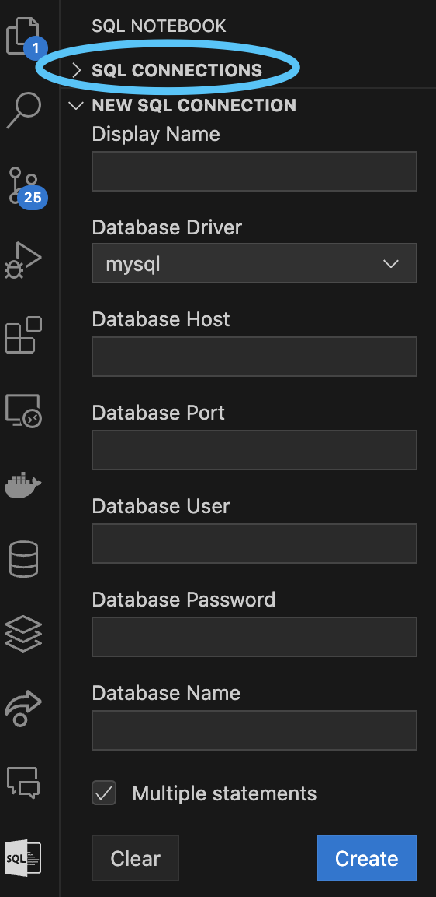

8. Connect to database 👇🏻

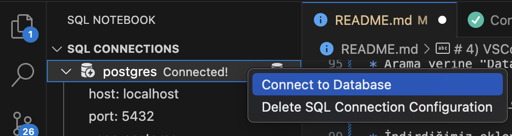

9. Create a sample database named "chinook" for demonstration purposes 👇🏻

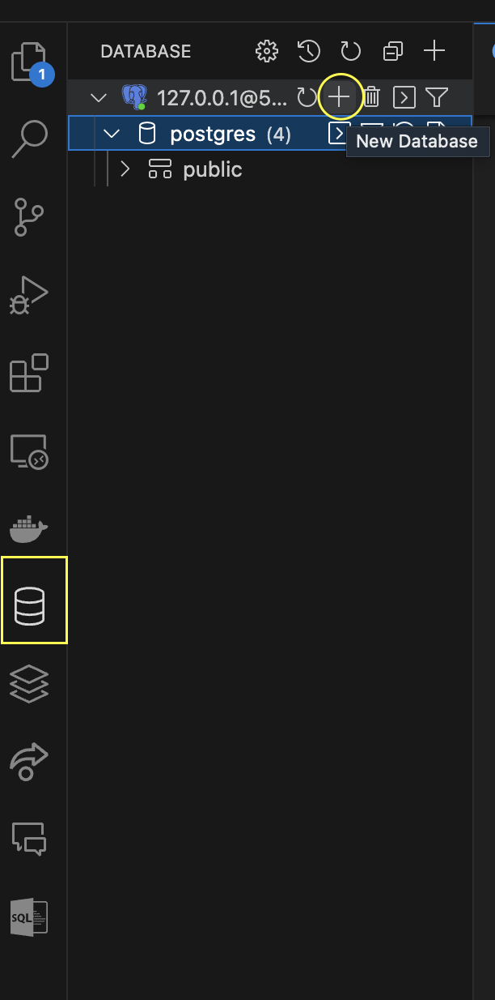

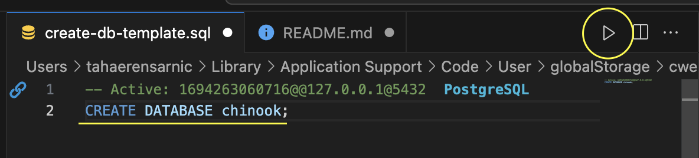

10. Check if your database is created 👇🏻

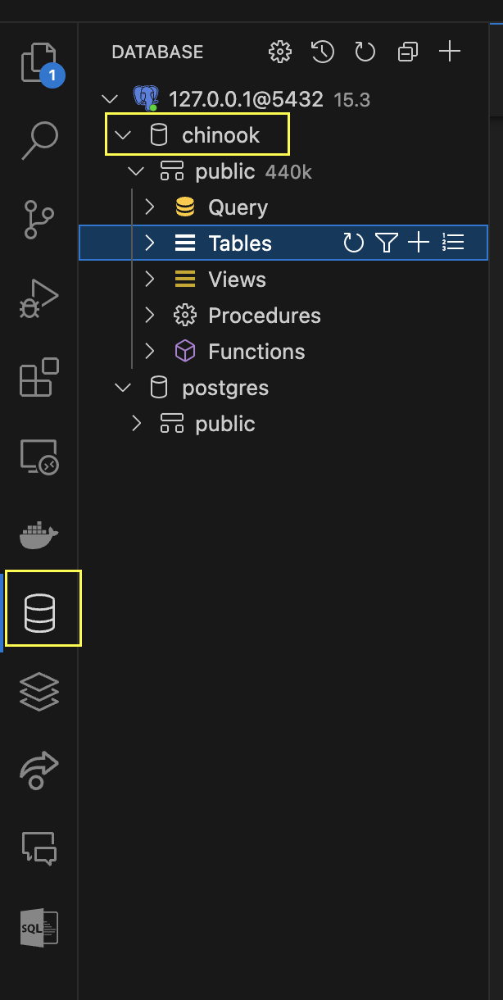

11. Create a connection for the related database from SQL Notebook extension 👇🏻

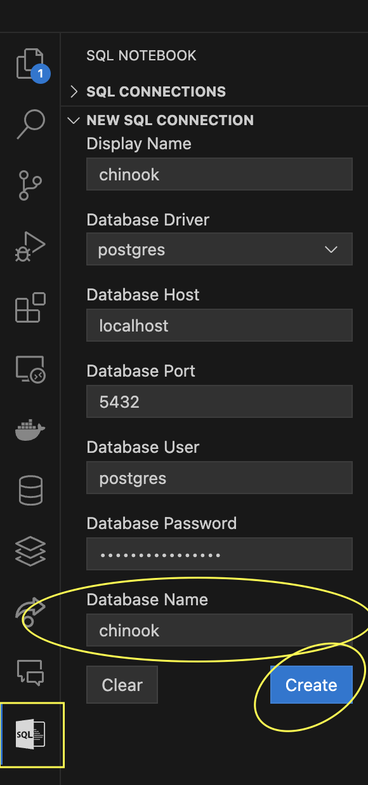

12. Right click and connect to the database 👇🏻

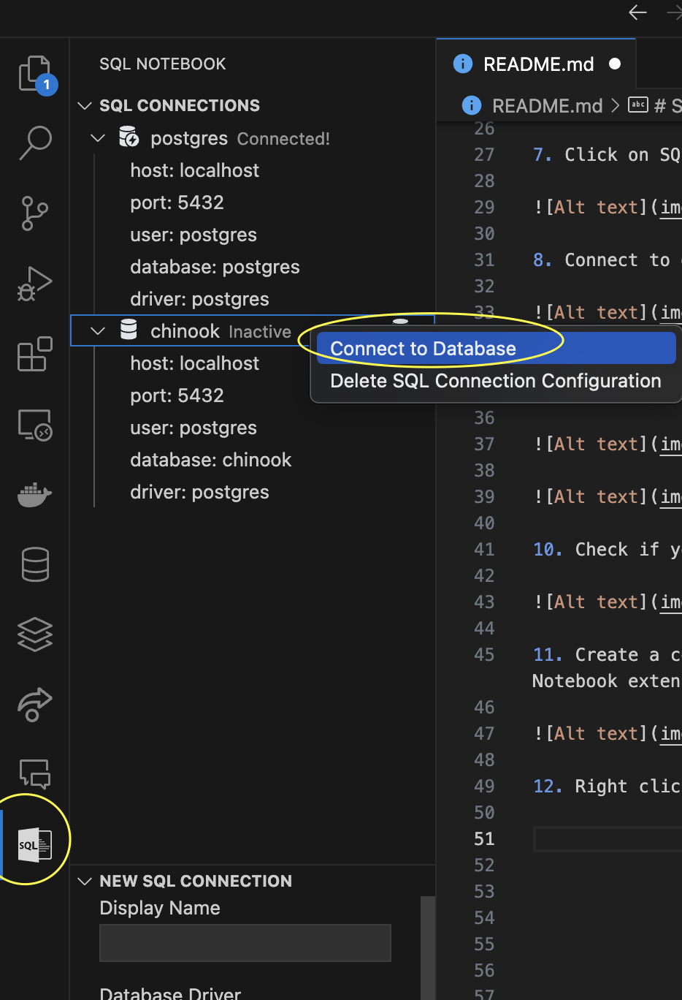

13. Now we can start using SQL Notebook! Right click on the related ".sql" file and select open with **"SQL Notebook"** 👇🏻
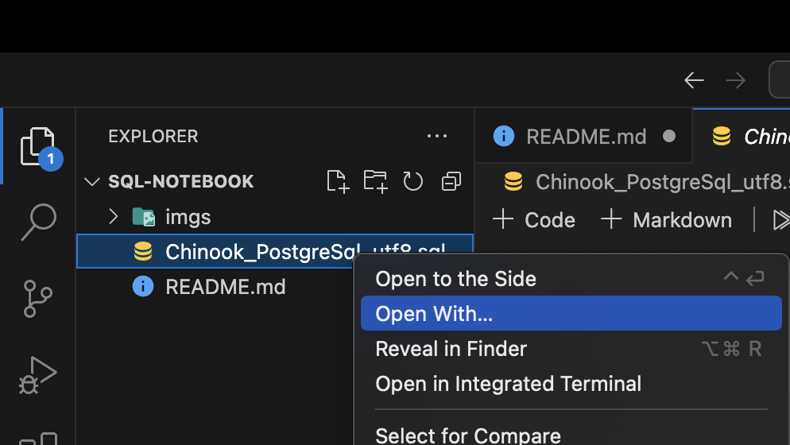

14. Now you can see that you can write markdown or SQL codes! Let's run all SQL cells to create tables in chinook database 👇🏻

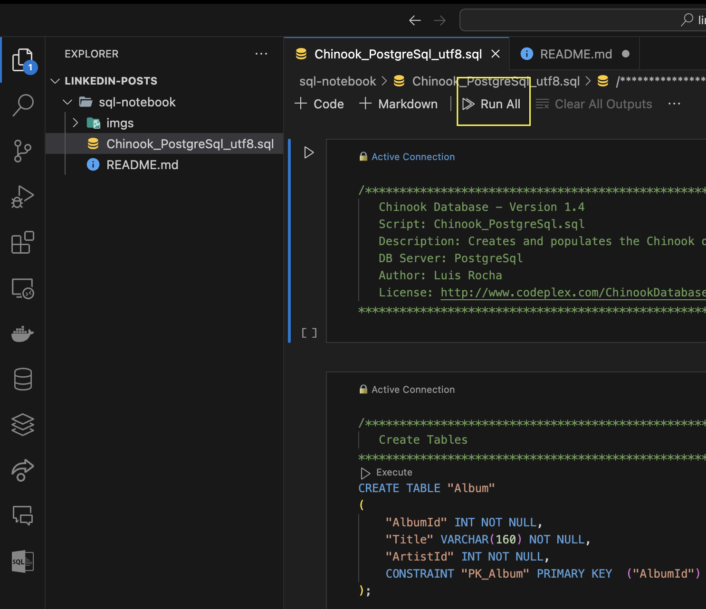

15. Let's check our tables 👇🏻

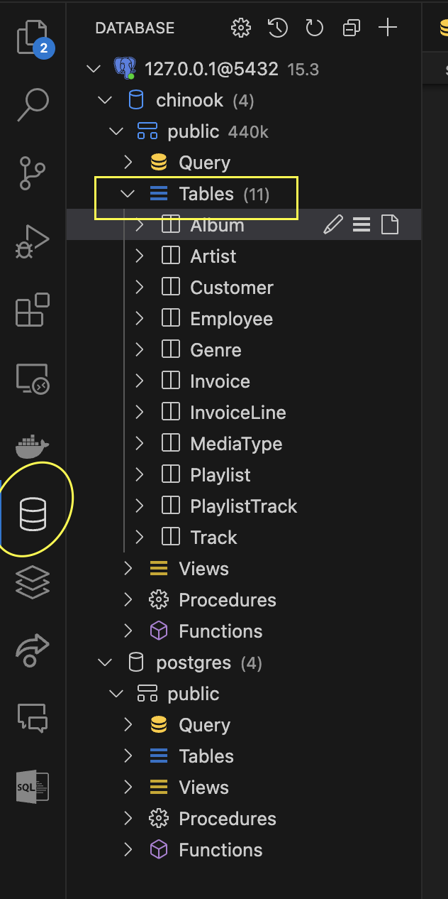

16. Let's create our data analytics "SQL Notebook" and open with the extension👇🏻

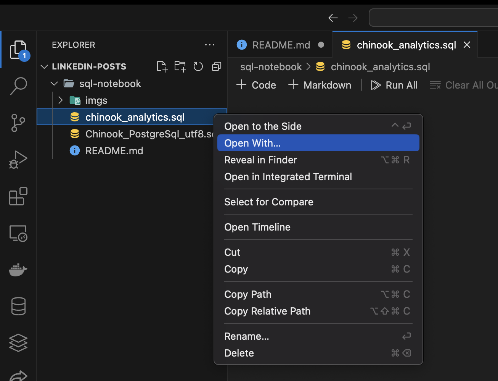

17. For markdown cells, simply click on plus sign with "Markdown" word 👇🏻

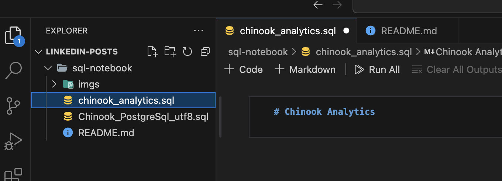

18. For SQL cells, click on plus sign with "Code". Write your query, and view the results 👇🏻

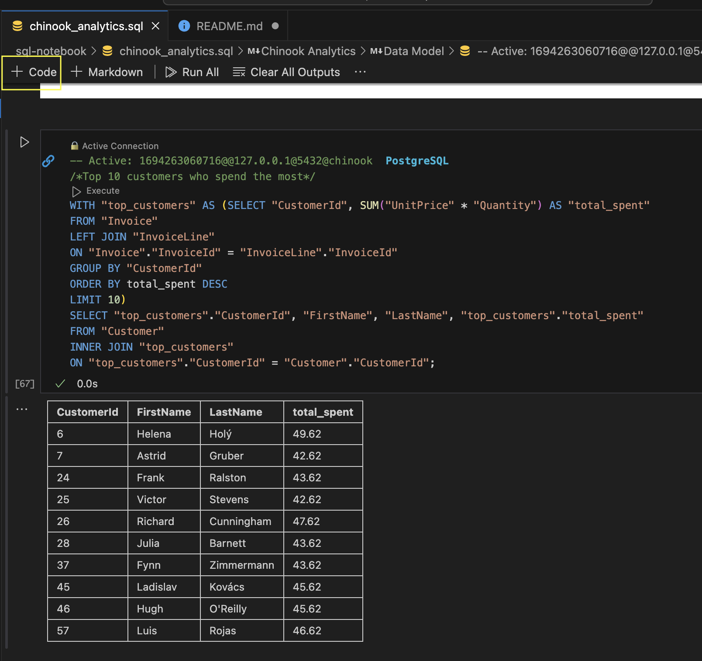

19. Our "SQL Notebook" is ready with writable Markdown and HTML cells and executable SQL codes 👇🏻

